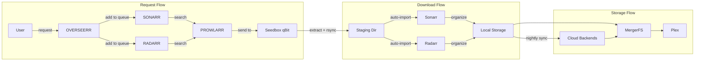

# 01 - Architecture Overview

## Why a Dedicated Server?

A VPS or shared hosting won't cut it for a media server. You need:

- **CPU:** Plex transcoding is CPU-intensive. 16 cores lets you handle multiple simultaneous streams without stuttering.
- **RAM:** 64GB gives headroom for rclone VFS caches, Docker containers, and Plex's media analysis.
- **Storage I/O:** NVMe drives in RAID1 provide the throughput for local media operations and rclone cache.
- **Bandwidth:** Most dedicated server providers include 1Gbps unmetered. You need this for cloud storage mounts and seedbox transfers.

A VPS might work for a single-user Plex setup, but the moment you add cloud storage mounts, a full arr stack, and monitoring... you'll feel the limits fast.

## Component List

| Component | Role | Why This One |
|-----------|------|-------------|
| **Plex** | Media streaming | Best client support, hardware transcoding |
| **Sonarr** | TV show management | Automates TV acquisition and organization |
| **Radarr** | Movie management | Same pattern as Sonarr, for movies |
| **Prowlarr** | Indexer management | Single config for all indexers, feeds Sonarr/Radarr |
| **Overseerr** | Request portal | Clean UI for users to request media |
| **Tautulli** | Plex analytics | Usage stats, watch history, notifications |
| **SWAG** | Reverse proxy + SSL | NGINX + Let's Encrypt, built for linuxserver containers |
| **MergerFS** | Union filesystem | Combines local + cloud into one path |
| **rclone** | Cloud storage mounts | FUSE mounts for encrypted cloud backends |
| **Prometheus** | Metrics collection | Time-series metrics for all services |
| **Grafana** | Dashboards | Visualization for Prometheus metrics |
| **Alertmanager** | Alert routing | Notifications when things break |

## How They Connect



## Design Principles

### 1. Subfolder Routing Over Subdomains

All services live behind a single domain at subfolder paths:

```
media.example.com/apps/sonarr
media.example.com/apps/radarr
media.example.com/apps/prowlarr
media.example.com/apps/tautulli
media.example.com/apps/overseerr
```

Why:
- One SSL certificate covers everything
- One Cloudflare Access policy protects all `/apps/*` paths
- Simpler DNS (one A record)
- No wildcard cert complexity

### 2. Zero-Trust Authentication

Cloudflare Access sits in front of the reverse proxy. Users authenticate through Cloudflare before their request ever reaches your server. No app-level passwords to manage, no exposed login pages to brute-force.

### 3. Encrypted Cloud Storage

All cloud backends are encrypted with rclone's crypt layer. Your cloud provider sees encrypted filenames and encrypted content. If they ever look at your data (or get breached), they see nothing useful.

### 4. Automated Pipeline

The full flow from "I want to watch this" to "it's playing on Plex" is automated:

1. User requests media in Overseerr
2. Sonarr/Radarr searches via Prowlarr
3. Torrent sent to seedbox
4. Seedbox downloads, extracts, transfers via rsync
5. Sonarr/Radarr auto-imports and organizes
6. Nightly script syncs local media to cloud
7. Plex sees it through MergerFS

Human intervention: zero (once configured).

### 5. Defense in Depth

Security isn't one layer... it's several:

- Cloudflare proxy hides your real IP
- Cloudflare Access authenticates users
- UFW blocks everything except Cloudflare IPs on 80/443
- SWAG validates Cloudflare Access JWT tokens
- Docker containers bind to 127.0.0.1 (not exposed to the network)
- rsync restricted to seedbox IP only
- SSH key-only authentication
