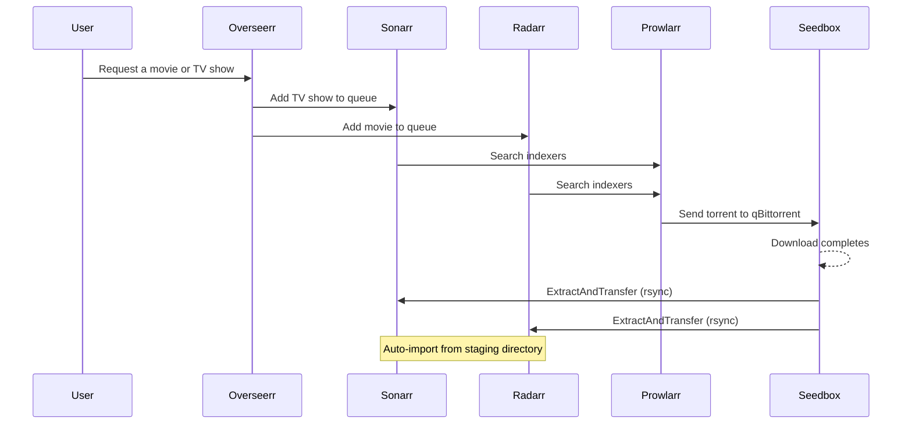

# 05 - Media Pipeline

The media pipeline is the automated flow from "I want to watch this" to "it's on Plex." Once configured, it runs without human intervention.

## Request Flow



## The Seedbox's Role

Downloads happen on a remote seedbox, not on the media server. This provides:

- **Bandwidth:** Seedboxes have multi-gigabit connections
- **IP separation:** Your media server IP is never associated with torrent swarms
- **Always-on seeding:** Maintain ratio requirements without consuming your server's bandwidth
- **ISP safety:** No torrent traffic touches your server's network

The seedbox runs qBittorrent and an automated extraction/transfer script. See [06 - Seedbox Integration](06-seedbox-integration.md) for details.

## The Extract-and-Transfer Pattern

Many downloads arrive as RAR archives (split across .rar, .r00, .r01, etc.). The seedbox script handles this:

1. **Scan:** Check qBittorrent API for completed downloads
2. **Extract:** If RARs are present, extract to a staging area
3. **Transfer:** rsync the extracted files to the media server's staging directory

```
Seedbox                          Media Server
┌─────────────────┐              ┌────────────────────┐
│  qBit download  │              │                    │
│  directory      │              │  /local/storage/   │
│       │         │              │  staging/          │
│       ▼         │              │       │            │
│  Extract RARs   │   rsync      │       ▼            │
│  to staging     │─────────────→│  Sonarr/Radarr     │
│                 │              │  auto-import       │
└─────────────────┘              │       │            │
                                 │       ▼            │
                                 │  /local/storage/   │
                                 │  mounts/local/     │
                                 │  TV Shows/         │
                                 │  Movies/           │
                                 └────────────────────┘
```

## rsync Daemon Setup

The media server runs an rsync daemon that accepts connections from the seedbox (and only the seedbox).

`/etc/rsyncd.conf`:

```ini
[staging]
    path = /local/storage/staging
    comment = Media staging area
    read only = no
    uid = mediauser
    gid = mediagroup
    hosts allow = 192.0.2.20
    hosts deny = *
    max connections = 4
    timeout = 300
```

Enable and start:

```bash
sudo systemctl enable rsync
sudo systemctl start rsync
```

The `hosts allow` line is critical. Only the seedbox IP can connect. Everyone else gets denied.

## Sonarr/Radarr Auto-Import

Both Sonarr and Radarr are configured to monitor the staging directory for new files:

### Sonarr

`Settings → Download Clients → Remote Path Mappings`:

| Host | Remote Path | Local Path |
|------|------------|------------|
| seedbox-host | /staging/ | /staging/ |

Sonarr watches the staging directory. When new files appear that match a monitored series, it:

1. Identifies the show and episode from the filename
2. Moves/hardlinks the file to the organized library (`/local-media/TV Shows/Show Name/Season XX/`)
3. Renames according to your naming scheme
4. Notifies Plex to scan the library

### Radarr

Same pattern. Radarr watches staging for movie files, identifies them, and moves them to the organized movie library.

### Import Settings

Key settings for both Sonarr and Radarr:

- **Use Hardlinks:** Yes (when possible). This avoids doubling disk usage during the staging-to-library move.
- **Root Folder:** `/local-media/TV Shows/` (Sonarr) or `/local-media/Movies/` (Radarr). This maps to `/local/storage/mounts/local/` on the host.
- **Recycle Bin:** Optional. Set to `/staging/recycle/` to keep deleted files temporarily.
- **Completed Download Handling:** Enabled. Sonarr/Radarr auto-import when they detect completed downloads.

## Cloud Sync: Local to Cloud

After media is imported locally, a nightly script syncs it to cloud storage. This is covered in detail in [07 - Cloud Sync](07-cloud-sync.md), but the high-level flow is:

```
/local/storage/mounts/local/TV Shows/
    │
    ▼  (nightly rclone copy)
cloud-crypt:TV Shows/
    │
    ▼  (rclone FUSE mount)
/local/storage/mounts/gdrive/TV Shows/
    │
    ▼  (MergerFS)
/local/storage/plexdrive/TV Shows/
```

Once the file is in cloud storage and accessible via the rclone mount, it's safe to delete the local copy. MergerFS will seamlessly serve it from the cloud mount instead.

## Full Lifecycle of a Media File

1. User requests "Breaking Bad" in Overseerr
2. Overseerr sends request to Sonarr
3. Sonarr searches Prowlarr for available releases
4. Prowlarr finds a match, sends torrent to seedbox's qBittorrent
5. qBittorrent downloads the file on the seedbox
6. ExtractAndTransfer script detects completion, extracts any RARs
7. Script rsyncs extracted files to media server's staging directory
8. Sonarr detects new files in staging, identifies the episode
9. Sonarr moves/renames the file to `/local/storage/mounts/local/TV Shows/Breaking Bad/Season 01/`
10. Sonarr notifies Plex to scan the library
11. Plex picks up the new episode, makes it available for streaming
12. Nightly cloud sync copies the file to Google Drive (encrypted)
13. Once confirmed in cloud, local copy is cleaned up
14. MergerFS continues to serve the file from the Google Drive rclone mount
15. User watches the episode on any Plex client

## Next Steps

For seedbox configuration details, see [06 - Seedbox Integration](06-seedbox-integration.md).
For the cloud sync process, see [07 - Cloud Sync](07-cloud-sync.md).
