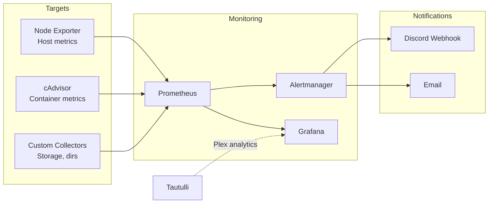

# 09 - Monitoring

You can't fix what you can't see. A media server with cloud storage mounts, a seedbox pipeline, and a dozen containers needs observability.

## Monitoring Stack



## Prometheus

Prometheus scrapes metrics from exporters at regular intervals and stores them as time-series data.

### Configuration

```yaml
# /local/storage/prometheus_config/prometheus.yml
global:
  scrape_interval: 15s
  evaluation_interval: 15s

rule_files:
  - "alerts.yml"

alerting:
  alertmanagers:
    - static_configs:
        - targets: ['alertmanager:9093']

scrape_configs:
  - job_name: 'prometheus'
    static_configs:
      - targets: ['localhost:9090']

  - job_name: 'node-exporter'
    static_configs:
      - targets: ['node-exporter:9100']

  - job_name: 'cadvisor'
    static_configs:
      - targets: ['cadvisor:8080']

  - job_name: 'directory-sizes'
    static_configs:
      - targets: ['localhost:9101']
    scrape_interval: 5m    # Directory sizes don't change fast
```

## Node Exporter

Provides host-level metrics: CPU, memory, disk, network.

Key metrics to watch:

| Metric | What It Tells You |
|--------|-------------------|
| `node_filesystem_avail_bytes` | Free disk space (critical for /local) |
| `node_cpu_seconds_total` | CPU usage (Plex transcoding spikes) |
| `node_memory_MemAvailable_bytes` | Available RAM |
| `node_network_receive_bytes_total` | Network throughput (cloud sync activity) |
| `node_load1` | 1-minute load average |

## cAdvisor

Provides container-level metrics: per-container CPU, memory, network, disk I/O.

Key metrics:

| Metric | What It Tells You |
|--------|-------------------|
| `container_cpu_usage_seconds_total` | CPU per container |
| `container_memory_usage_bytes` | Memory per container |
| `container_network_receive_bytes_total` | Network per container |
| `container_fs_usage_bytes` | Disk per container |

## Custom Directory Size Collector

Cloud storage mounts and local directories need size monitoring. A simple script that exposes directory sizes as Prometheus metrics:

```bash
#!/usr/bin/env bash
# /local/storage/scripts/dir-size-collector.sh
#
# Runs as a simple HTTP server exposing directory sizes as Prometheus metrics.
# Designed to be scraped by Prometheus at /metrics.

DIRS=(
    "/local/storage/mounts/local"
    "/local/storage/staging"
    "/local/storage/cache"
)

PORT=9101
METRICS_FILE="/tmp/dir_metrics.prom"

while true; do
    {
        echo "# HELP directory_size_bytes Size of directory in bytes"
        echo "# TYPE directory_size_bytes gauge"
        for dir in "${DIRS[@]}"; do
            if [ -d "$dir" ]; then
                size=$(du -sb "$dir" 2>/dev/null | cut -f1)
                label=$(echo "$dir" | sed 's|/|_|g' | sed 's|^_||')
                echo "directory_size_bytes{path=\"${dir}\"} ${size:-0}"
            fi
        done
    } > "${METRICS_FILE}"

    # Serve metrics via a simple HTTP response
    # In practice, use a proper exporter or textfile collector
    sleep 300  # Update every 5 minutes
done
```

A cleaner approach is to use Prometheus's textfile collector with Node Exporter:

```bash
# Write metrics to the textfile collector directory
TEXTFILE_DIR="/local/storage/prometheus_config/textfile_collector"
mkdir -p "${TEXTFILE_DIR}"

# Cron job writes metrics file
*/5 * * * * /local/storage/scripts/dir-sizes-to-prom.sh > "${TEXTFILE_DIR}/dir_sizes.prom"
```

Then configure Node Exporter with `--collector.textfile.directory=/textfile_collector`.

## Alertmanager

Routes alerts from Prometheus to notification channels.

### Configuration

```yaml
# /local/storage/alertmanager_config/alertmanager.yml
global:
  resolve_timeout: 5m

route:
  receiver: 'default'
  group_by: ['alertname']
  group_wait: 30s
  group_interval: 5m
  repeat_interval: 4h

receivers:
  - name: 'default'
    webhook_configs:
      - url: 'https://discord.com/api/webhooks/YOUR_WEBHOOK_ID/YOUR_WEBHOOK_TOKEN'
        send_resolved: true
```

### Alert Rules

```yaml
# /local/storage/prometheus_config/alerts.yml
groups:
  - name: media-server
    rules:
      - alert: DiskSpaceLow
        expr: node_filesystem_avail_bytes{mountpoint="/local"} / node_filesystem_size_bytes{mountpoint="/local"} < 0.15
        for: 5m
        labels:
          severity: warning
        annotations:
          summary: "Disk space below 15% on /local"

      - alert: DiskSpaceCritical
        expr: node_filesystem_avail_bytes{mountpoint="/local"} / node_filesystem_size_bytes{mountpoint="/local"} < 0.05
        for: 2m
        labels:
          severity: critical
        annotations:
          summary: "Disk space below 5% on /local - immediate action required"

      - alert: ContainerDown
        expr: absent(container_last_seen{name=~"plex|sonarr|radarr|prowlarr|overseerr|swag"})
        for: 5m
        labels:
          severity: critical
        annotations:
          summary: "Container {{ $labels.name }} is down"

      - alert: HighCPU
        expr: 100 - (avg by(instance) (rate(node_cpu_seconds_total{mode="idle"}[5m])) * 100) > 90
        for: 10m
        labels:
          severity: warning
        annotations:
          summary: "CPU usage above 90% for 10 minutes"

      - alert: HighMemory
        expr: (1 - node_memory_MemAvailable_bytes / node_memory_MemTotal_bytes) > 0.90
        for: 5m
        labels:
          severity: warning
        annotations:
          summary: "Memory usage above 90%"

      - alert: RcloneMountDown
        expr: node_filesystem_avail_bytes{mountpoint=~"/local/storage/mounts/(gdrive|backblaze|blomp)"} == 0
        for: 5m
        labels:
          severity: critical
        annotations:
          summary: "rclone mount {{ $labels.mountpoint }} appears down"
```

## Tautulli: Plex Analytics

Tautulli provides Plex-specific insights:

- Who's watching what, when
- Transcoding vs direct play statistics
- Bandwidth usage per stream
- Library statistics (total items, recently added)
- Watch history and trends

Configure notifications in Tautulli for:
- Stream started/stopped
- New media added
- Plex server unreachable
- Buffer warnings

Tautulli is accessed via the reverse proxy at `/apps/tautulli`, protected by Cloudflare Access like everything else.

## Grafana Dashboards

Recommended dashboards:

| Dashboard | Data Source | Shows |
|-----------|------------|-------|
| Node Exporter Full | Prometheus | CPU, memory, disk, network |
| Docker Container Monitoring | Prometheus (cAdvisor) | Per-container resources |
| Storage Overview | Prometheus (custom) | Directory sizes, cloud mount status |
| Media Pipeline | Custom | Downloads pending, import queue, sync status |

Grafana is accessible at `/apps/grafana` via SWAG, behind Cloudflare Access.

### Example: Disk Usage Panel

```
Panel: Disk Usage /local
Query: 100 - (node_filesystem_avail_bytes{mountpoint="/local"} / node_filesystem_size_bytes{mountpoint="/local"} * 100)
Visualization: Gauge
Thresholds: 0-70 green, 70-85 yellow, 85-100 red
```

## What to Monitor

| Category | What | Why |
|----------|------|-----|
| **Storage** | /local free space | Prevent disk full (everything breaks) |
| **Storage** | Staging directory size | Detect import pipeline stalls |
| **Storage** | rclone mount availability | Cloud mounts can drop silently |
| **Containers** | Up/down status | Detect crashed services |
| **Containers** | Memory usage | Sonarr/Radarr can leak memory |
| **Network** | Bandwidth in/out | Detect unusual activity |
| **Pipeline** | rsync transfer rates | Seedbox transfer health |
| **Plex** | Active streams | Capacity planning |
| **Plex** | Transcode count | CPU pressure indicator |

## Next Steps

See [10 - Disaster Recovery](10-disaster-recovery.md) for backup strategy and rebuild procedures.
