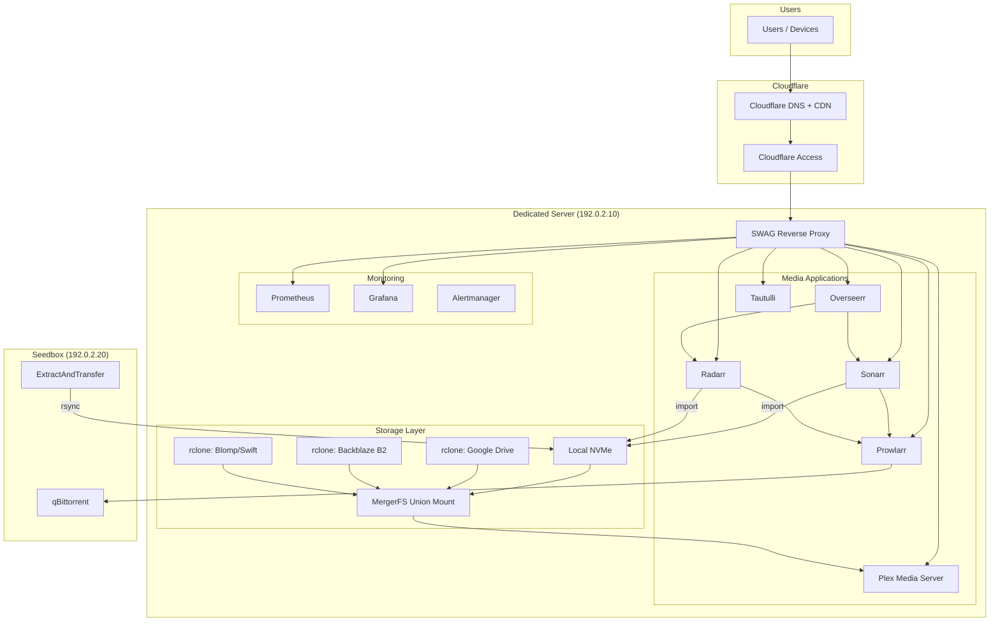

# Media Server Architecture Guide

A production home media server with an automated download pipeline, multi-cloud encrypted storage, and zero-trust web access.

## Who This Is For

Homelab enthusiasts who want to build a self-hosted media server that:

- Streams via Plex with hardware transcoding
- Automates media requests and acquisition
- Stores media across multiple encrypted cloud backends
- Presents a unified filesystem to Plex via MergerFS
- Secures all web services behind Cloudflare Access (zero-trust)
- Routes everything through subfolder paths on a single domain

## Prerequisites

| Requirement | Minimum | Recommended |
|-------------|---------|-------------|
| Dedicated server | 8 cores, 32GB RAM | 16 cores, 64GB RAM |
| Local storage | 500GB NVMe | 2x 1TB NVMe (RAID1) |
| Cloud storage | 1 provider (Google Drive) | 2-3 providers for redundancy |
| Seedbox | Any with SSH access | Feral, Whatbox, or similar |
| Domain | 1 domain on Cloudflare DNS | Same |
| OS | Ubuntu 22.04+ | Ubuntu 24.04 LTS |

## Architecture Overview

## Guide Structure

| Chapter | Topic |
|---------|-------|
| [01 - Overview](01-overview.md) | Architecture overview and design principles |
| [02 - Hardware & OS](02-hardware-and-os.md) | Server selection, OS setup, partitioning |
| [03 - Storage Layer](03-storage-layer.md) | rclone mounts, MergerFS, multi-cloud storage |
| [04 - Docker Services](04-docker-services.md) | Media stack containers and reverse proxy |
| [05 - Media Pipeline](05-media-pipeline.md) | Automated media acquisition flow |
| [06 - Seedbox Integration](06-seedbox-integration.md) | Remote downloading and transfer |
| [07 - Cloud Sync](07-cloud-sync.md) | Local-to-cloud media migration |
| [08 - Networking & Security](08-networking-and-security.md) | Zero-trust access and firewall |
| [09 - Monitoring](09-monitoring.md) | Prometheus, Grafana, and alerting |
| [10 - Disaster Recovery](10-disaster-recovery.md) | Backup strategy and rebuild checklist |

## Config Examples

The `config-examples/` directory contains sanitized, ready-to-adapt configuration files:

- [`rclone-mount.service.example`](config-examples/rclone-mount.service.example) - systemd service for rclone FUSE mount
- [`mergerfs.service.example`](config-examples/mergerfs.service.example) - MergerFS union mount service
- [`docker-compose.example.yml`](config-examples/docker-compose.example.yml) - Full media stack compose file
- [`swag-subfolder.conf.example`](config-examples/swag-subfolder.conf.example) - SWAG/NGINX subfolder proxy config
- [`extract-and-transfer.sh.example`](config-examples/extract-and-transfer.sh.example) - Seedbox extraction and transfer script

## License

This guide is shared for educational purposes. Adapt it to your own infrastructure.
