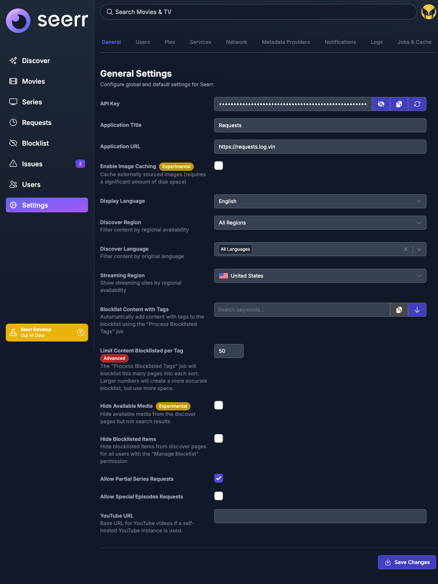
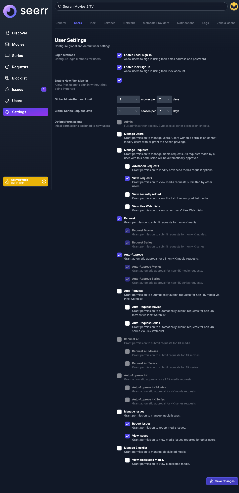
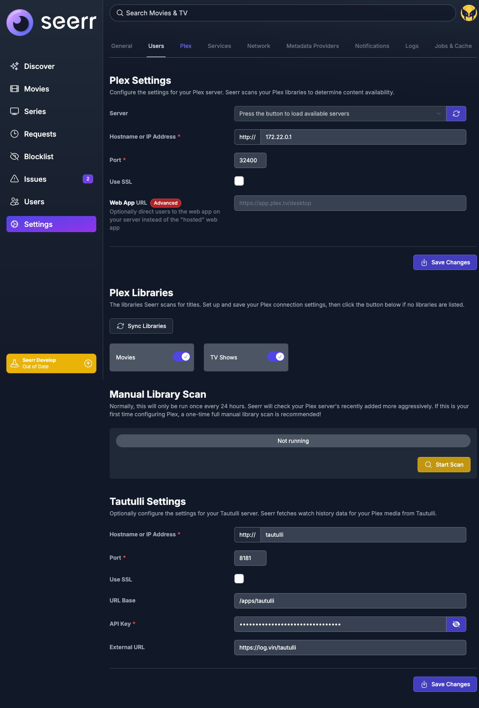
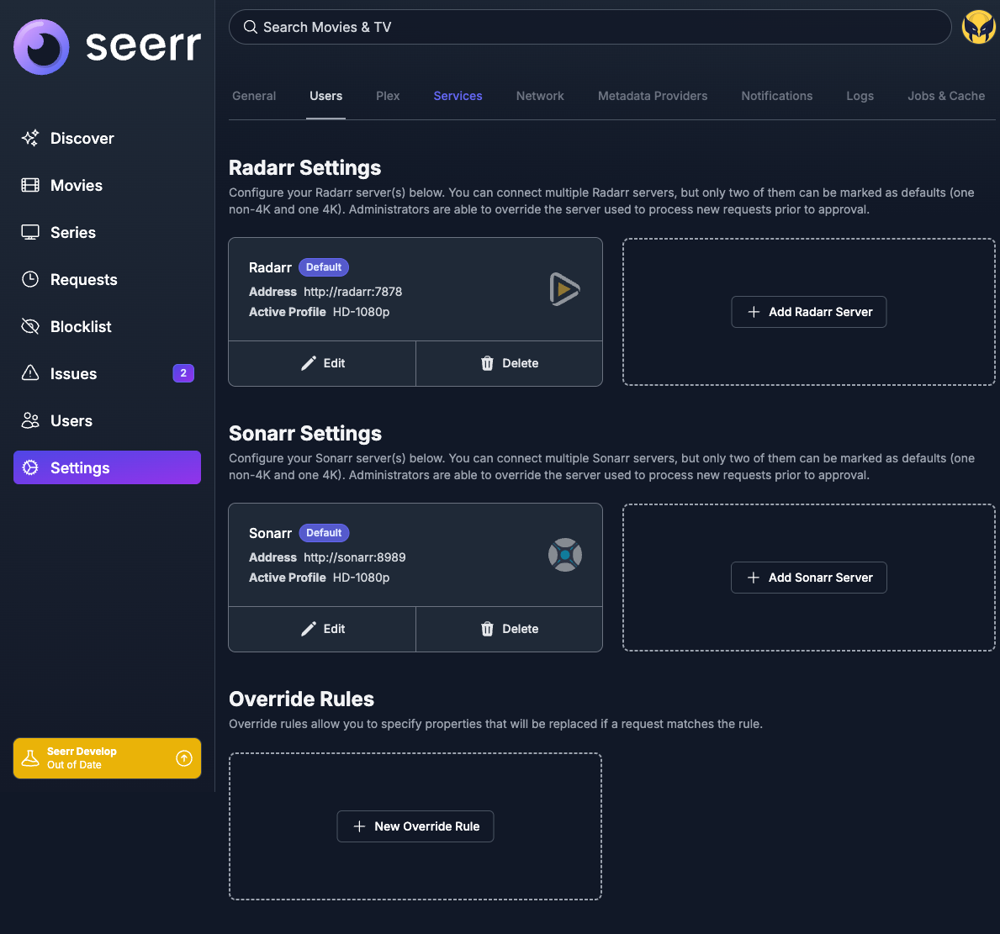
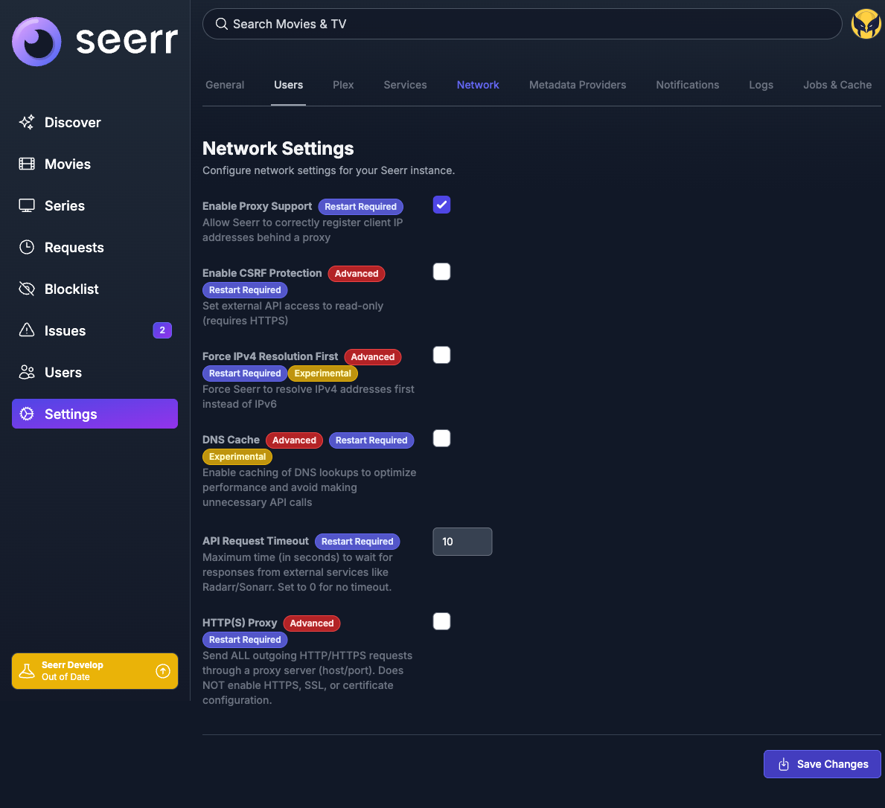
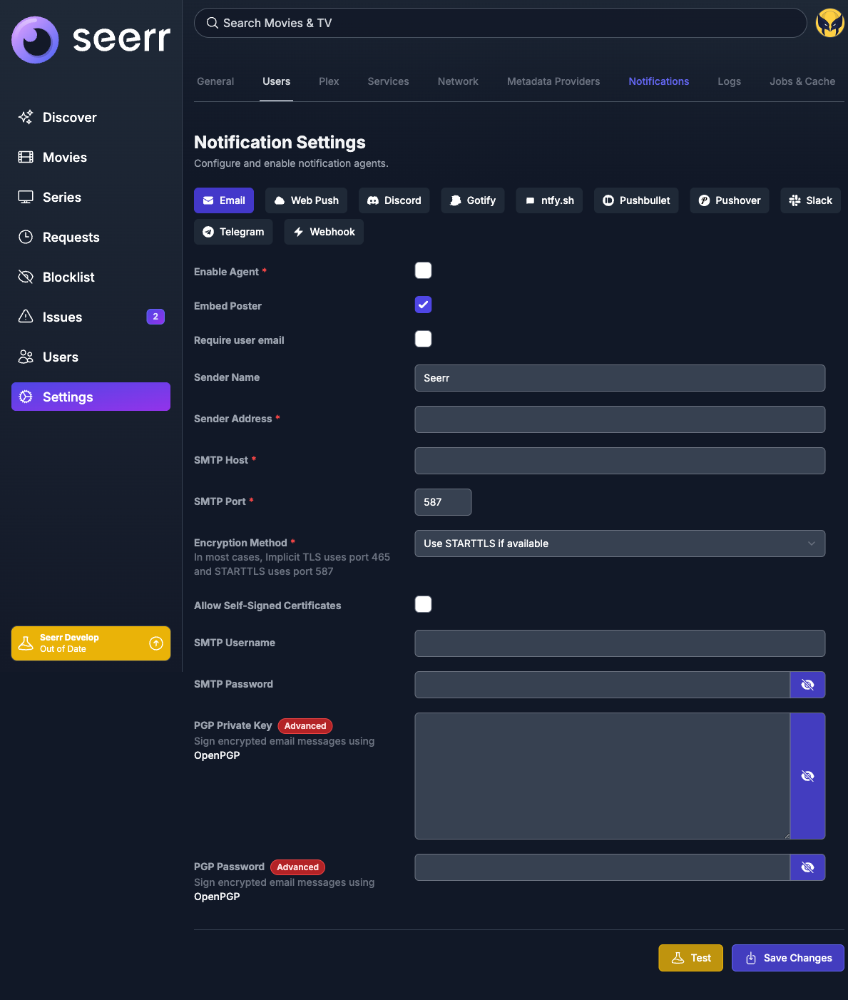
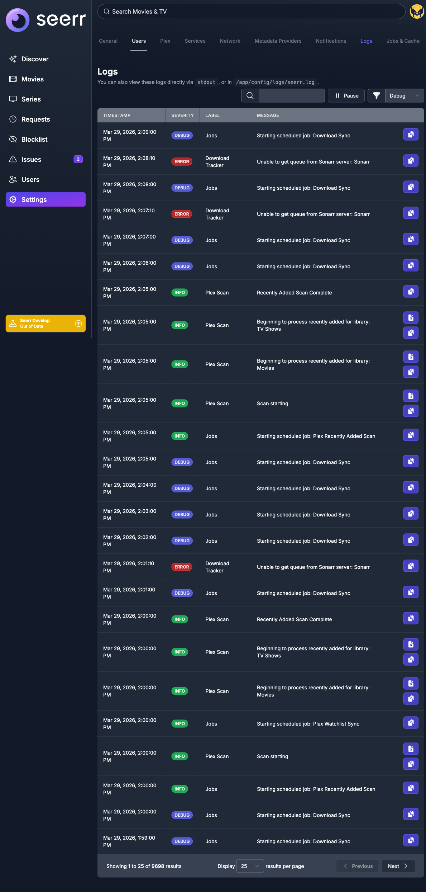
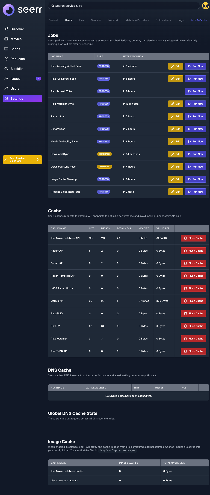
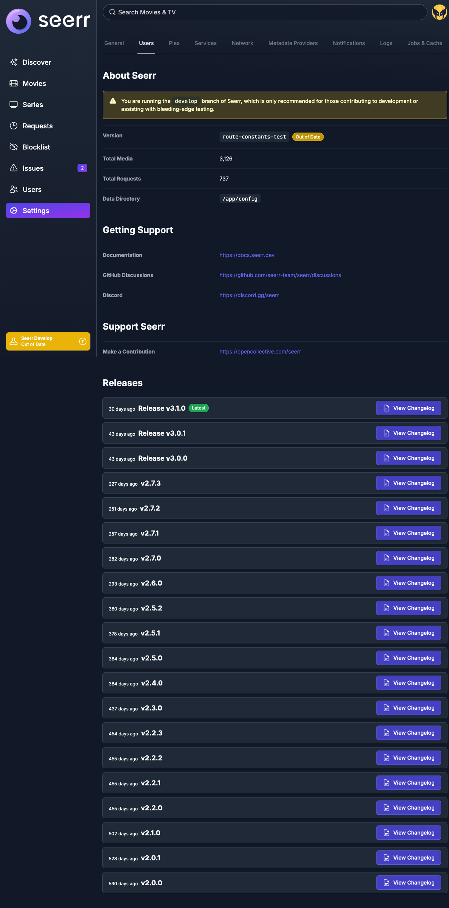

# Seerr Settings UX Audit

Tab-by-tab audit of the current settings pages, documenting inconsistencies against the proposed [Settings UX Standards](settings-ux-standards.md). Screenshots captured from a live Seerr instance running the `develop` branch.

## How to Read This

Each tab gets:
- A full-page screenshot of its current state
- A list of issues (deviations from the proposed standard)
- A proposed fix

The goal is to get alignment on the standards first, then apply changes tab-by-tab in separate PRs.

---

## 1. General Settings

**What works:**
- H3 heading with description paragraph
- Two-column label/input layout
- Badge usage on relevant fields (Experimental, Advanced)

**Issues:**
- One long wall of 14 settings with no logical groupings
- Mixes identity settings (API Key, Title, URL) with discovery settings (Region, Language) and content rules (Blocklist, Hide Available Media) with no visual separation
- No `label-tip` on several fields that would benefit from one (Application Title, Allow Partial Series Requests)

**Proposed fix:** Group into `<SettingsSection>` blocks:
- "Application Identity" (API Key, Title, URL)
- "Discovery & Language" (Display Language, Region, Language, Streaming Region)
- "Content Visibility" (Hide Available, Hide Blocklisted, Partial/Special Requests)
- "Blocklist" (Tag settings, Limit per Tag)

---

## 2. User Settings

**What works:**
- "Login Methods" is grouped as a fieldset
- Request limit dropdowns use a clear "X per Y days" pattern

**Issues:**
- "Login Methods" uses a `fieldset`/`group` pattern that no other tab uses
- "Default Permissions" has 26 checkboxes in a flat list with no sub-grouping
- No visual separation between Login Methods, Request Limits, and Permissions

**Proposed fix:** Use `<SettingsSection>` to separate "Login Methods", "Request Limits", and "Default Permissions" with clear H3 headings and descriptions.

---

## 3. Plex Settings

**What works:**
- H3 sub-headings for each section (Plex Settings, Plex Libraries, Manual Library Scan, Tautulli Settings)
- Clear descriptions for each section

**Issues:**
- **Two Save buttons** on a single page: one for Plex connection, one for Tautulli
- Tautulli section has its own independent form but visually reads as just another section
- No Test button for Plex connection (should have one, since it connects to an external service)

**Proposed fix:** Either combine into one form with one Save, or move Tautulli to its own tab. Add a Test button for the Plex connection.

---

## 4. Services

**What works:**
- Card + modal pattern is appropriate for managing multiple server instances
- Dashed-border "Add" tile is a clear affordance
- "Default" badge on cards identifies the primary server

**Issues:**
- Card badges ("Default", "SSL") use a different style than form badges on other tabs
- This is the only tab using the card pattern, which is correct but should be explicitly documented as the exception

**Proposed fix:** Keep the card layout. Standardize badge colors to match the rest of settings. Document this as the intended pattern for multi-instance management.

---

## 5. Network Settings

**What works:**
- All fields use the standard two-column layout
- Badge usage correctly identifies restart-required, advanced, and experimental fields

**Issues:**
- **Triple badge stacking** on DNS Cache and Force IPv4: "Advanced" + "Restart Required" + "Experimental"
- Double badges on CSRF Protection and HTTP(S) Proxy
- Flat list of toggles with no section grouping
- Badge stacking creates visual noise; hard to parse what's important

**Proposed fix:**
- Group into sections: "Core" (Proxy Support, API Timeout) and "Advanced / Experimental" (CSRF, Force IPv4, DNS Cache, HTTP Proxy)
- Use section-level badges when all fields share the same badge (e.g., "All settings in this section require a restart")
- Enforce the max-two-badges-per-field rule

---

## 6. Metadata Providers

**What works:**
- Has both Test and Save buttons (correct pattern for external service connection)
- Clean layout with minimal fields

**Issues:**
- Page description is terse: "Settings for metadata provider" (compare to General's "Configure global and default settings for Seerr")
- Heading hierarchy is inconsistent: H3 page title, H4 for "Metadata Provider Status", H2 for "Metadata Provider Selection"
- Two peer sections using different heading levels

**Proposed fix:** Standardize description to match the voice and detail level of other tabs. Fix heading hierarchy: H3 for page title, H3 for all sub-sections.

---

## 7. Notification Settings

**What works:**
- Sub-tabs for each notification agent (Email, Discord, etc.)
- Each agent has Test + Save buttons (correct)
- Standard two-column form layout within each agent

**Issues:**
- Sub-tab bar wraps on smaller viewports
- No major structural issues; this is one of the more consistent tabs

**Proposed fix:** Keep the sub-tab pattern. Ensure each agent's form uses `<FormRow>` internally.

---

## 8. Logs

**What works:**
- Data display tab correctly uses table pattern (not a form)
- Filter and pagination controls are well-placed
- Inline `code` elements in the description are appropriate

**Issues:**
- Description is functional but could be more consistent with other tabs' voice

**Proposed fix:** Minor; ensure description follows the standard one-line format. This tab is otherwise well-structured for a data display view.

---

## 9. Jobs & Cache

**What works:**
- Clear H3 section headings (Jobs, Cache, DNS Cache, Global DNS Cache Stats, Image Cache)
- Each section has its own description paragraph
- Tables with inline action buttons (Edit, Run Now, Flush Cache)
- **This is the best-structured tab** and should be the reference for how data display tabs are built

**Issues:**
- Minor: no page-level description (the Jobs heading jumps straight into the table description)

**Proposed fix:** Use this tab as the reference implementation for data display tabs. Add a one-line page-level description.

---

## 10. About

**What works:**
- Definition lists for key-value data (semantically correct)
- Clear H3 section headings (About Seerr, Getting Support, Support Seerr, Releases)
- Release history is well-structured with changelog buttons

**Issues:**
- **No page-level description** at all (every other tab has one)

**Proposed fix:** Add a description: "Information about your Seerr installation and available updates."

---

## Summary

| Issue | Affected Tabs |
|-------|---------------|
| No section grouping (flat field list) | General, Network |
| Multiple Save buttons per page | Plex |
| Badge stacking (3+ badges per field) | Network |
| Missing or terse page descriptions | Metadata, About |
| Inconsistent heading hierarchy | Metadata (H2/H3/H4 mixed) |
| No shared form components | All form tabs |

## Implementation Plan

This should be done incrementally, one tab per PR:

1. **Phase 1: Standards approval** — Get alignment on the [Settings UX Standards](settings-ux-standards.md) before writing any code
2. **Phase 2: Shared components** — Create `<SettingsSection>`, `<FormRow>`, `<SettingsActions>`
3. **Phase 3: Reference implementation** — Apply to General as the first tab
4. **Phase 4: Remaining tabs** — One PR per tab, each referencing the standard
