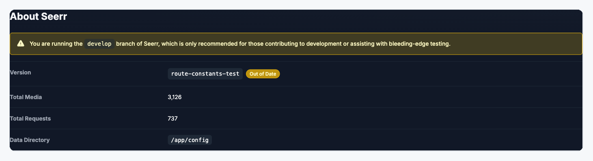
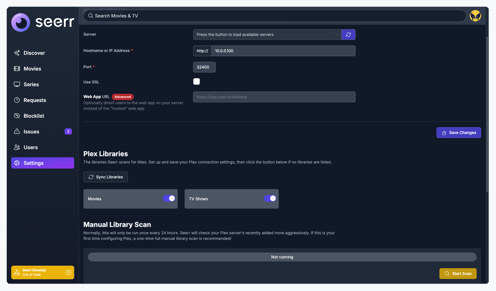
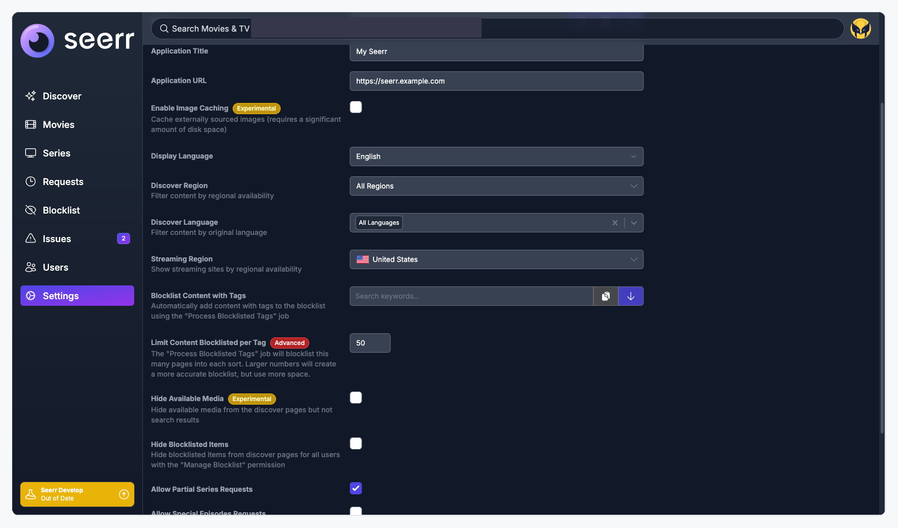
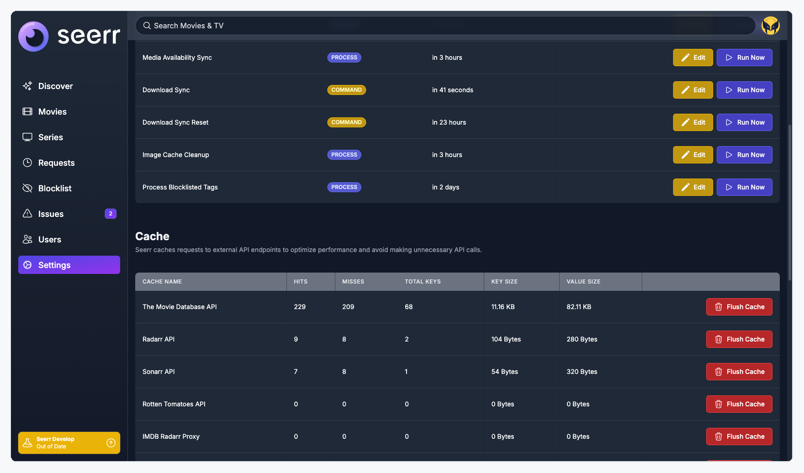
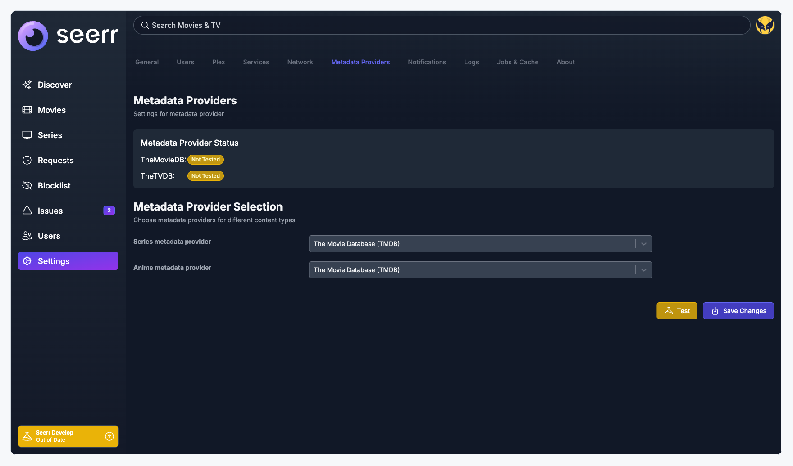
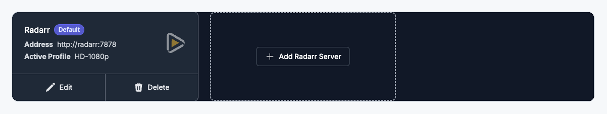
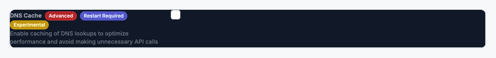
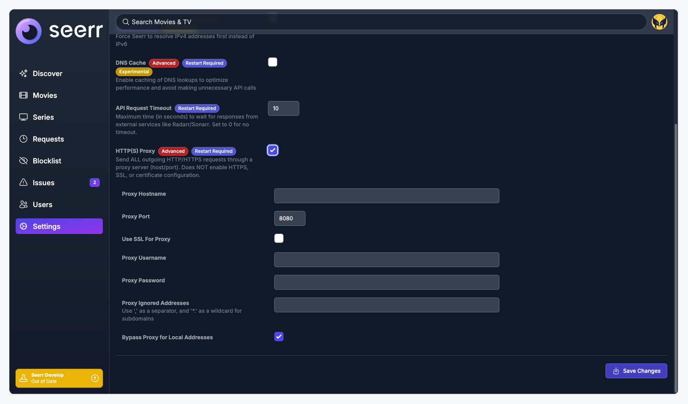

# Settings Page UX Standards

A contributor guide for building and maintaining Settings pages in Seerr. These standards define the structure, layout, and interaction patterns that every settings tab must follow.

> **Audience:** Anyone adding a new settings tab, modifying an existing one, or reviewing a settings-related PR.

---

## Why Standards Matter

Settings pages are where trust lives. Users configure API keys, external service connections, and permissions here. Inconsistent layouts force users to re-learn the interface on every tab, and contributors end up copy-pasting JSX from whichever tab they happen to open first.

Research backs this up:

- **Nielsen Norman Group** found that forms following consistent usability guidelines see 78% first-try error-free submission rates, versus 42% for inconsistent forms. ([nngroup.com](https://www.nngroup.com/articles/web-form-design/))
- **Ant Design's form specification** recommends tab grouping when form items exceed 15, and card grouping when content exceeds two screens. ([ant.design](https://ant.design/docs/spec/research-form/))
- **GitLab's Pajamas Design System** explicitly states: "Never use a combination of manual and auto-save within the same form." ([design.gitlab.com](https://design.gitlab.com/patterns/settings-management/))

The standards below draw from these systems and others. References are cited inline so you can trace each principle to its source.

---

## Page Structure

### Page Header

Every settings tab starts with exactly one page-level header: an H3 heading and a one-line description.

```
h3.heading     "Network Settings"
p.description  "Configure network settings for your Seerr instance."
```

The description should be a complete sentence in active voice. It tells the user what this tab controls.

**Do this:**


*Clear heading with a complete, descriptive sentence.*

**Not this:**


*Incomplete fragment. Doesn't tell the user what they can do here.*



*No description at all. Users land on the page with no context.*

> **i18n note:** Descriptions use i18n message keys, not hardcoded English. Keep sentences simple and avoid idioms... they translate poorly. See the [i18n section](#internationalization-i18n) for details.

**Reference:** Atlassian Design System requires that form titles use h2 if they're the main item on a page, otherwise h3, and that heading levels are never skipped. ([atlassian.design](https://atlassian.design/components/heading/))

---

### Sections

When a tab contains logically distinct groups of fields, wrap each group in a `<SettingsSection>` with its own heading and optional description.

```tsx
<SettingsSection
  title="Proxy Settings"
  description="Configure an HTTP/HTTPS proxy for outbound API requests."
>
  {/* FormRow children */}
</SettingsSection>
```

**Use a section when:**
- 3 or more fields share a logical domain (e.g., "Proxy", "DNS", "Security")
- A group of related toggles (e.g., "Login Methods", "Auto-Approve")
- A distinct feature area on a multi-purpose tab

**Do not use a section when:**
- Fewer than 3 fields; spacing between form rows is sufficient
- The entire tab is one logical group (e.g., a single notification agent's settings)

**Do this:**



*Clear H3 sub-headings with descriptions. Each section is a distinct logical group.*

**Not this:**



*Identity fields run directly into discovery settings with no grouping. Users have to scan the entire list to find what they need.*

**Reference:** NNg's research on the Gestalt Law of Proximity shows that related items placed closer together are perceived as belonging together, and that whitespace alone can create clear groupings without adding visual complexity. ([nngroup.com](https://www.nngroup.com/articles/form-design-white-space/))

### Section Dividers

Use the existing `border-t border-gray-700` pattern with top padding between sections. This is the same treatment used above the `.actions` save bar.

### Heading Hierarchy

Page title is H3. All sub-sections within the page are also H3. Never skip heading levels (e.g., H3 then H2, or H3 then H5).

**Do this:**



*Jobs & Cache uses consistent H3 headings for all sections. Each section has its own description paragraph. Visual hierarchy is clear and predictable.*

**Not this:**



*H4 "Metadata Provider Status" next to H2 "Metadata Provider Selection" on the same page. Screen readers and visual hierarchy both break.*

**Reference:** Atlassian's heading guidelines state that h1-h6 must be used in descending sequence, and this is critical for both accessibility and visual hierarchy. ([atlassian.design](https://atlassian.design/components/heading/))

---

## Shared Components

### Why Components, Not Just CSS

The CSS classes for settings pages (`.heading`, `.form-row`, `.text-label`, `.actions`, etc.) handle the look. Shared React components handle the **layout contract**: the correct div nesting, ARIA attributes, badge placement, and error positioning that every tab needs.

Without shared components, each new tab is built by copying an existing tab and tweaking it. This introduces drift that compounds over time. A layout fix to one tab doesn't propagate to others.

**Reference:** Carbon Design System emphasizes that forms should use shared components to ensure "associated information" is consistently grouped, and that button labels should be task-specific rather than abstract. ([carbondesignsystem.com](https://carbondesignsystem.com/patterns/forms-pattern/))

### `<SettingsSection>`

Wraps a logical group of settings with a header and optional description.

```tsx
<SettingsSection
  title="Proxy Settings"
  description="Configure an HTTP/HTTPS proxy for outbound API requests."
>
  {/* FormRow children */}
</SettingsSection>
```

Renders:
```html
<div class="mb-6">
  <h3 class="heading">Proxy Settings</h3>
  <p class="description">Configure an HTTP/HTTPS proxy...</p>
</div>
<div>{children}</div>
```

### `<FormRow>`

Wraps every label + input pair in the standard grid layout.

```tsx
<FormRow
  label="API Key"
  tip="Your unique API key for external access"
  required
  badges={['advanced']}
  error={touched.apiKey && errors.apiKey}
>
  <Field type="text" name="apiKey" />
</FormRow>
```

Renders the standard two-column grid: label column (with tip, badges, required marker) and input column (with error display).

> **i18n note:** The `label` and `tip` props accept i18n message keys. The component handles text expansion gracefully; labels and tips wrap naturally without breaking the grid. See the [i18n section](#internationalization-i18n).

### `<SettingsActions>`

The save/test button footer.

```tsx
<SettingsActions
  isSubmitting={isSubmitting}
  onTest={testConnection}
  isTesting={isTesting}
/>
```

---

## Form Patterns

### Pattern 1: Inline Form (default)

A single Formik form with `<FormRow>` fields and a `<SettingsActions>` footer.

**Rules:**
- One form per logical scope
- One save button per form
- Fields use `<FormRow>` for consistent layout
- Validation errors shown inline below each field

**Reference:** GitLab Pajamas explicitly states: "Never use a combination of manual and auto-save within the same form." This extends to never having multiple independent save actions on a single page without clear visual separation. ([design.gitlab.com](https://design.gitlab.com/patterns/settings-management/))

### Pattern 2: Card + Modal Form

A grid of cards representing instances, with Add/Edit/Delete actions that open modal dialogs.

**When to use:** Managing multiple instances of a configurable thing (e.g., Radarr/Sonarr servers). The card shows a summary; the modal shows the full edit form.



*Cards for server instances with a dashed-border "Add" tile. This is the correct pattern for multi-instance management.*

**Rules:**
- Grid layout: `grid-cols-1 lg:grid-cols-2 xl:grid-cols-3`
- Add button as dashed-border tile at end of grid
- Edit/Delete buttons in card footer
- Modal forms follow the same `<FormRow>` standard internally

### Mixing Patterns

Do not mix inline form and card+modal patterns within a single logical section. If a tab needs both, use separate `<SettingsSection>` blocks with clear headers.

---

## Save and Test Buttons

### Save Button

- **One** per form, bottom-right in `<SettingsActions>`
- `buttonType="primary"`
- Text: "Save Changes" (idle), "Saving..." (submitting)
- Icon: `ArrowDownOnSquareIcon`
- Disabled when: submitting, or form is invalid/pristine

If a tab has multiple independent save buttons, the forms must be restructured:
1. Combine into one form with one save
2. Separate into distinct sections, each with a clearly scoped save
3. Move one form to a different tab entirely

**Do this:**


*One Save Changes button per form, bottom-right. Test button (yellow) to the left when applicable.*

**Not this:**


*Two independent Save buttons on one page. Users can't tell which settings belong to which button without scrolling.*

**Reference:** Carbon Design System states that for non-modal forms, buttons should be aligned to the left with form controls and use task-specific labels. NNg recommends one primary action per form to reduce cognitive load. ([carbondesignsystem.com](https://carbondesignsystem.com/patterns/forms-pattern/), [nngroup.com](https://www.nngroup.com/articles/4-principles-reduce-cognitive-load/))

### Test Button

Appropriate when the settings connect to an external service and the test validates connectivity without saving.

- Position: Left of Save button
- `buttonType="warning"`
- Text: "Test" (idle), "Testing..." (testing)
- Disabled when: testing, or required connection fields are empty


*Test (yellow) left of Save Changes (purple). Clear visual hierarchy.*

**Tabs that should have Test:** Metadata, all Notification agents, Tautulli, Plex (server connection)
**Tabs that should not:** General, Users, Network, Jobs, Logs, About

---

## Badges

Three badge types from `SettingsBadge`:

| Badge | Color | Meaning | Tooltip |
|-------|-------|---------|---------|
| `restartRequired` | Blue | Seerr must restart for changes to take effect | "Seerr must be restarted..." |
| `advanced` | Red | Misconfiguration may break functionality | "Incorrectly configuring..." |
| `experimental` | Yellow | May cause unexpected behavior | "Enabling this setting..." |

### Rules

- **Maximum two badges per field.** If a field needs all three, it belongs behind an "Advanced Settings" section toggle rather than in the main field list.
- **Badge order** (when stacked): `restartRequired`, then `advanced` or `experimental`
- **Placement:** Inline after the label text, before any `label-tip`
- **Section-level badges:** When all fields in a section share the same badge (e.g., all proxy fields require restart), place the badge on the section header instead of repeating it on every field.

**Do this:**


*One badge per field. The label, badge, and tip are all clearly readable.*

**Not this:**



*Three badges on a single field. Visual noise drowns out the actual setting.*

**Reference:** NNg's consistency heuristic (Heuristic #4) states that interactive components should use the same visual presentation throughout a product. Inconsistent badge density across tabs forces users to re-calibrate their attention on every page. ([nngroup.com](https://www.nngroup.com/articles/consistency-and-standards/))

---

## Field Labels

### Label Classes

| Class | Usage |
|-------|-------|
| `.text-label` | Standard text input, select, or complex field |
| `.checkbox-label` | Checkbox or toggle field |
| `.label-tip` | Description text below the label (gray, smaller font) |
| `.label-required` | Red asterisk after label text for required fields |
| `.error` | Validation error message below the input |

### Guidelines

- Every non-obvious field should have a `label-tip` explaining what it does or when to change it
- Obvious fields (Port, SSL, Hostname) do not need a tip
- Tips should be concise: one sentence, no period at the end
- Required fields must show `.label-required`
- Error messages appear only after the field has been touched

**Do this:**


*Bold label, followed by a gray tip that explains what the setting controls. Users don't have to guess.*

**Reference:** Atlassian's form patterns recommend left-aligning labels with the field underneath, and marking required fields with an asterisk unless all fields are mandatory. ([atlassian.design](https://atlassian.design/patterns/forms/))

---

## Conditional Fields

When a toggle enables a group of sub-settings (e.g., "Enable Proxy" reveals proxy host/port/auth):

- **Indent** sub-fields with `ml-4 mr-2`
- **Show/hide** with conditional rendering, not disabled state
- The parent toggle's `label-tip` should mention that enabling it reveals additional options
- Sub-fields animate in (no jarring layout shift)

**Do this:**



*HTTP(S) Proxy toggle reveals indented sub-fields for hostname, port, SSL, and credentials. Only visible when the parent toggle is enabled.*

**Reference:** GOV.UK's form design guidance emphasizes progressive disclosure: only showing fields that are relevant to the user's current selection, reducing cognitive load and preventing errors. ([gov.uk](https://www.gov.uk/service-manual/design/form-structure))

---

## Sub-Tab Navigation

When a settings tab contains many distinct agents or providers (e.g., notification agents), use a sub-tab bar within the settings content area.


*Each notification agent gets its own sub-tab. The parent tab "Notifications" holds them all.*

**Rules:**
- Each sub-tab is a self-contained form with its own Save/Test buttons
- The sub-tab bar should not wrap on standard viewport widths; use horizontal scrolling if needed
- Each sub-tab follows all the same standards as a top-level settings tab (header, sections, `<FormRow>`, etc.)

---

## Data Display Tabs

Logs, Jobs & Cache, and About are read-only data views, not forms.


*Jobs & Cache: Clear H3 section headings, each with its own description. Action buttons inline with rows.*

**Rules:**
- **Table component** for tabular data (Logs, Cache stats, Job list)
- **List component** for key-value display (About)
- Action buttons inline with rows (Run Now, Flush Cache, Copy)
- **No save buttons.** These tabs do not modify settings.
- Still require a page-level H3 heading + description paragraph

---

## Accessibility

- Form groups with related fields should use `role="group"` with `aria-labelledby`
- Checkbox labels must be clickable (wrapping `<label>` around both checkbox and text)
- Tooltip-only information should also be available via `label-tip` for users who can't hover
- Badge tooltips should use `aria-label` so screen readers convey the meaning
- Form errors must be associated with their field via `aria-describedby`

**Reference:** Carbon Design System requires wrapping checkbox/radio groups with `<fieldset>` and `<legend>`, and GOV.UK recommends setting the legend/label as the page heading so screen reader users hear the content only once. ([carbondesignsystem.com](https://carbondesignsystem.com/components/form/usage/), [design-system.service.gov.uk](https://design-system.service.gov.uk/patterns/question-pages/))

---

## Internationalization (i18n)

Seerr supports 37+ languages. Every design decision must account for this.

### Text and Layout

- All user-facing text (labels, tips, badges, button text, error messages) must use i18n message keys via the existing translation system
- No hardcoded English strings in component JSX
- New keys should follow the existing namespace pattern: `components.Settings.{TabName}.{fieldName}`
- After adding keys, run `pnpm i18n:extract` to update locale files

### Design for Text Expansion

German translations average 30% longer than English. Finnish and other agglutinative languages can be even longer. ([W3C Internationalization](https://www.w3.org/International/))

- Labels and tips must wrap gracefully; never use fixed widths that truncate translated text
- Use `min-width` instead of fixed `width` on form elements
- Test layouts with longer strings (a rough test: double the English label length)
- Button text should be concise even in the source language; shorter English means shorter translations

### RTL (Right-to-Left) Support

Seerr supports Arabic and Hebrew. Layout must work in RTL mode.

- Use CSS logical properties (`margin-inline-start` instead of `margin-left`, `padding-inline-end` instead of `padding-right`)
- Icons depicting direction or sequence must mirror in RTL layouts
- The two-column label/input grid should flip naturally with logical properties

**Reference:** Material Design's bidirectionality guidelines state that an RTL layout is the mirror image of an LTR layout, and that icons depicting sequences must also be mirrored. ([m3.material.io](https://m3.material.io/foundations/layout/understanding-layout/bidirectionality-rtl))

### Label and Tip Content

- Keep label text short and specific; avoid full sentences in labels
- Tips can be longer but should remain one sentence
- Avoid idioms, slang, or culture-specific references in source strings
- Use consistent terminology: pick one term for each concept and use it everywhere (e.g., always "Save Changes", never "Save" or "Submit")

**Reference:** NNg's consistency heuristic states: "If you use 'edit' in some places and 'change' in other places to achieve the same action, people may feel less confident." This applies equally across languages. ([nngroup.com](https://www.nngroup.com/articles/consistency-and-standards/))

---

## URL Structure and Deep Linking

### Tab URLs

Every settings tab must have a clean, descriptive URL path. The URL segment should match the tab's display name in lowercase.

| Tab Name | URL | Notes |
|----------|-----|-------|
| General | `/settings/general` | Prefer `general` over `main` |
| Users | `/settings/users` | |
| Plex | `/settings/plex` | |
| Services | `/settings/services` | |
| Network | `/settings/network` | |
| Metadata Providers | `/settings/metadata` | |
| Notifications | `/settings/notifications/{agent}` | Sub-tabs for each agent |
| Logs | `/settings/logs` | |
| Jobs & Cache | `/settings/jobs` | |
| About | `/settings/about` | |

### Section Anchors

Each `<SettingsSection>` should generate a URL anchor from its title so users and developers can link directly to a specific section.

For example, `https://seerr.example.com/settings/plex#tautulli-settings` should scroll directly to the Tautulli section.

**Rules:**
- Anchor IDs are generated from the section title: lowercase, spaces replaced with hyphens
- A small link icon appears on hover next to section headings (same pattern as GitHub markdown headings)
- Clicking the icon copies the full URL with anchor to the clipboard

This lets contributors reference specific settings in issues, PRs, and documentation with a direct link.

---

## Copy Settings as Markdown

### Purpose

When users report issues or ask for help, they often need to share their current settings. Manually transcribing field values is error-prone and tedious. A "Copy as Markdown" feature gives them a one-click way to capture settings in a paste-friendly format.

### Page-Level Copy

A "Copy Settings" button in the page header copies all fields on the current tab as a Markdown table:

```markdown
## General Settings

| Setting | Value |
|---------|-------|
| Application Title | My Seerr |
| Application URL | https://seerr.example.com |
| Enable Image Caching | Disabled |
| Display Language | English |
| Discover Region | All Regions |
| ...   | ...   |
```

### Section-Level Copy

Each `<SettingsSection>` header also has a copy button that copies only that section's fields.

### Sensitive Field Redaction

Fields marked as sensitive (API keys, passwords, tokens) must be automatically redacted in the Markdown output. The redaction should happen at the component level, not as a post-processing step.

| Field Type | Redacted Output |
|------------|----------------|
| API Key | `[REDACTED]` |
| Password | `[REDACTED]` |
| Token | `[REDACTED]` |
| Hostname/IP | Shown (not sensitive by default) |

Contributors can opt specific fields into redaction via the `<FormRow>` component:

```tsx
<FormRow
  label="API Key"
  sensitive
>
  <Field type="text" name="apiKey" />
</FormRow>
```

The `sensitive` prop tells the Copy function to output `[REDACTED]` instead of the actual value.

---

## Troubleshooting Data (About Page)

### Purpose

When users file GitHub issues, maintainers almost always need environment details. Currently, users have to manually copy version info, server type, and other diagnostic data from the About page. A dedicated "Troubleshooting Data" section with a copy button eliminates this friction.

### Proposed Section

Add a "Troubleshooting Data" section to the About page that displays key environment details in a compact, readable format:

| Field | Example Value |
|-------|---------------|
| Seerr Version | `v3.1.0` (develop) |
| Media Server | Plex |
| Node.js Version | `v22.22.0` |
| Database | SQLite |
| OS | Linux (Alpine 3.22) |
| Architecture | arm64 |
| Timezone | America/Phoenix |
| Total Media | 3,126 |
| Total Requests | 737 |
| Configured Services | Radarr (1), Sonarr (1) |
| Notification Agents | Email, Discord |

### Copy Button Behavior

A "Copy Troubleshooting Data" button formats the data as a Markdown code block ready to paste into a GitHub issue:

````markdown
```
Seerr: v3.1.0 (develop)
Media Server: Plex
Node.js: v22.22.0
Database: SQLite
OS: Linux (Alpine 3.22, arm64)
Timezone: America/Phoenix
Media: 3,126 | Requests: 737
Services: Radarr (1), Sonarr (1)
Notifications: Email, Discord
```
````

**Redaction rules apply:** API keys, hostnames, and IP addresses are excluded from this output. The goal is diagnostic metadata, not configuration secrets.

### GitHub Issue Template Integration

The project's GitHub issue templates should include a section that prompts users to paste their troubleshooting data:

```markdown
### Environment

<!-- Paste the output of the "Copy Troubleshooting Data" button from Settings > About -->

```

This standardizes the information maintainers receive and reduces back-and-forth in issue triage.

---

## References

Design systems and research cited in this document:

| Source | Topic | URL |
|--------|-------|-----|
| Material Design | Settings patterns, bidirectionality | [m1.material.io](https://m1.material.io/patterns/settings.html), [m3.material.io](https://m3.material.io/foundations/layout/understanding-layout/bidirectionality-rtl) |
| Ant Design | Form page specification | [ant.design](https://ant.design/docs/spec/research-form/) |
| Carbon Design System | Form patterns, fieldsets | [carbondesignsystem.com](https://carbondesignsystem.com/patterns/forms-pattern/) |
| Atlassian Design | Form layout, heading hierarchy | [atlassian.design](https://atlassian.design/patterns/forms/) |
| GOV.UK Design System | Form structure, progressive disclosure | [design-system.service.gov.uk](https://design-system.service.gov.uk/patterns/question-pages/) |
| GitLab Pajamas | Settings management, save patterns | [design.gitlab.com](https://design.gitlab.com/patterns/settings-management/) |
| Nielsen Norman Group | Form usability, consistency, grouping, cognitive load | [nngroup.com](https://www.nngroup.com/articles/web-form-design/) |
| W3C Internationalization | Text expansion, personal names, i18n best practices | [w3.org](https://www.w3.org/International/) |
